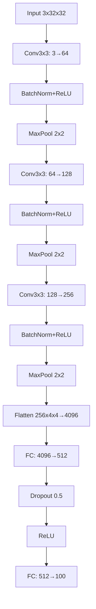

# Image-Classification-On-Cifar-100
Implementations in pytorch of different network architectures for image classification on the Cifar-100 dataset 

### Simple CNN
Network that serves the foundation for future models I make

Accuracy of the network on the 10000 test images after 20 epochs: 22.43 % 

