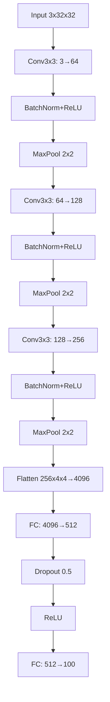
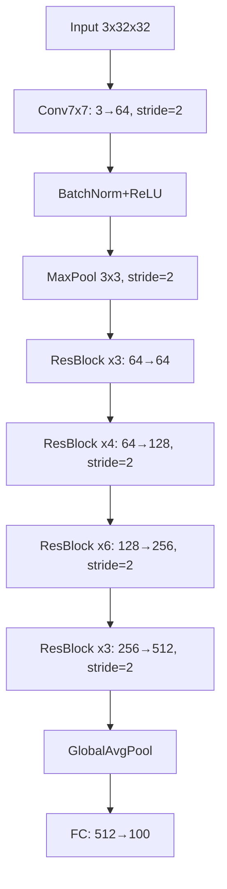
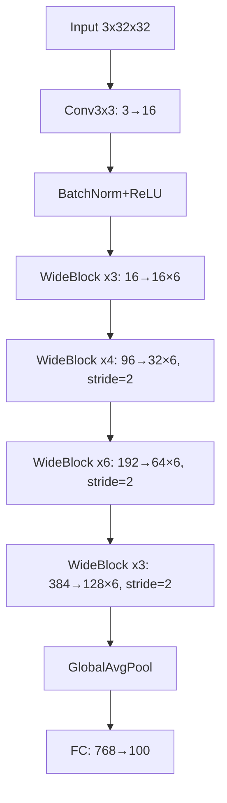

# Image-Classification-On-Cifar-100
Implementations in pytorch of different network architectures for image classification on the Cifar-100 dataset 

## Simple CNN
Network that serves the foundation for future models I make

Key features:
- Simple VGG-style architecture
- Batch norm + ReLU 
- Dropout for regulisation  

Accuracy of the network on the 10000 test images after 20 epochs: 22.43 % 

## ResNet 

Implementation of ResNet 

Key improvements:
- implemented a Resdiual block that utilises skip connections and progressive downsampling 
- Deeper network
- Kaiming initalisation
- More epochs

Accuracy of the network on the 10000 test images after 60 epochs: 44.35 % 

## WideResNet

Implementation of WideResNet 

Key improvements:
- Implemented a Wide Residual block 
- Wider not deeper network
- Data regulization (CutMix/MixUp, RandomCrop, normalise to SD/mean, +more)

Accuracy of the network on the 10000 test images after 60 epochs: 72.22 % 

